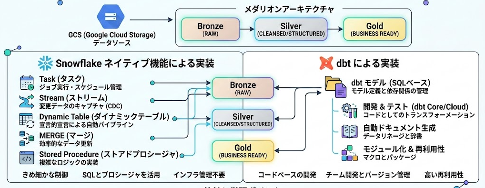

# Snowflake メダリオンアーキテクチャ + dbt ハンズオン

GCS（Google Cloud Storage）から Snowflake への **メダリオンアーキテクチャ（Bronze / Silver / Gold）** ETL パイプラインを構築するハンズオンプロジェクト。

**Snowflake ネイティブ機能**（Task, Stream, Dynamic Table, MERGE, Stored Procedure）と **dbt** の両方で同じパイプラインを実装し、それぞれのアプローチを比較しながら学べる構成。



## 想定データ: ID-POS 小売データ

ポイントカード付き POS（ID-POS）の購買データを題材にしています。

| コレクション | 内容 | 方式 | 規模 | 検証ポイント |
|------------|------|------|------|------------|
| members | 会員マスタ | 全量（Full） | 1,000 件 | Dynamic Table 自動リフレッシュ |
| transactions | 購買トランザクション | 日次（Daily） | 初期 10 万 + 差分 1 万 | Stream + MERGE（1.7% 更新） |
| daily_member_summary | 会員別日次集計 | 日次（Daily） | 初期 35 万 + 差分 1 万 | Stream + MERGE（98% 更新） |

## アーキテクチャ

```
GCS バケット（JSONL.gz）
    ↓ External Stage
Snowflake
    ├─ Bronze … Task + COPY INTO で GCS からロード
    │    ↓ Stream が変更検知
    ├─ Silver … 全量: Dynamic Table（自動リフレッシュ）
    │           日次: Task + MERGE（Stream 駆動）
    │    ↓
    └─ Gold  … Dynamic Table（Silver 参照、自動リフレッシュ）
```

## プロジェクト構成

```
snowflake_medallion_dbt/
├── .env.example              # 認証情報テンプレート
│
├── sql/                      # Snowflake SQL（Snowsight で番号順に実行）
│   ├── 01_database_setup.sql       # DB / Schema / Warehouse
│   ├── 02_storage_integration.sql  # Storage Integration
│   ├── 03_iam_setup.sql            # IAM 連携
│   ├── 04_file_format_stage.sql    # File Format / External Stage
│   ├── 05_stage_verify.sql         # Stage 接続確認
│   ├── 06_monitoring_tables.sql    # 監視テーブル
│   ├── 07_bronze_tables.sql        # Bronze テーブル + Stream
│   ├── 08_stored_procedures.sql    # Stored Procedure
│   ├── 09_initial_load.sql         # 初期データロード
│   ├── 10_silver_members_dt.sql    # Silver MEMBERS (Dynamic Table)
│   ├── 11_silver_tables.sql        # Silver TRANSACTIONS / DAILY_MEMBER_SUMMARY
│   ├── 12_initial_merge.sql        # 初回 MERGE 実行
│   ├── 13_merge_tasks.sql          # MERGE Task + DAILY_LOAD Task
│   ├── 14_gold_dynamic_tables.sql  # Gold Dynamic Tables
│   ├── 15_quality_task.sql         # 品質チェック Task
│   ├── 16_task_resume.sql          # 全 Task 有効化
│   ├── 17_task_suspend.sql         # 全 Task 無効化
│   ├── 18_git_repository.sql       # Git リポジトリ接続
│   ├── 19_dbt_project.sql          # dbt Project オブジェクト
│   └── 20_dbt_task.sql             # dbt Task チェーン
│
├── dbt_project/              # dbt プロジェクト
│   ├── models/
│   │   ├── staging/          # Silver 層（stg_members, stg_transactions, stg_daily_member_summary）
│   │   └── marts/            # Gold 層（mart_monthly_active_members 等）
│   ├── macros/               # Jinja マクロ
│   ├── snapshots/            # SCD Type 2 スナップショット
│   └── tests/                # カスタムテスト
│
└── docs/                     # 設計・実装ドキュメント
```

## Snowflake オブジェクト構成

```
RETAIL_DWH (Database)
│
├── BRONZE (Schema)
│   ├── [Stage]     GCS_RAW_DATA
│   ├── [Table]     MEMBERS / TRANSACTIONS / DAILY_MEMBER_SUMMARY
│   ├── [Stream]    MEMBERS_STREAM / TRANSACTIONS_STREAM / DAILY_MEMBER_SUMMARY_STREAM
│   ├── [Procedure] LOAD_COLLECTION / LOAD_ALL
│   └── [Task]      DAILY_LOAD（毎日 01:00 JST）
│
├── SILVER (Schema)
│   ├── [Dynamic Table] MEMBERS（Bronze 参照、TARGET_LAG 1 時間）
│   ├── [Table]         TRANSACTIONS / DAILY_MEMBER_SUMMARY
│   └── [Task]          MERGE_TRANSACTIONS / MERGE_DAILY_MEMBER_SUMMARY（Stream 駆動）
│
├── GOLD (Schema)
│   ├── [Dynamic Table] MONTHLY_ACTIVE_MEMBERS
│   ├── [Dynamic Table] MONTHLY_SALES_SUMMARY
│   └── [Dynamic Table] MEMBER_PURCHASE_SUMMARY
│
└── MONITORING (Schema)
    ├── [Table] LOAD_LOG / QUALITY_LOG
    └── [Task]  DATA_QUALITY_CHECK
```

### Task 依存関係

```
BRONZE.DAILY_LOAD（CRON 毎日 01:00 JST）
    ├── SILVER.MERGE_TRANSACTIONS          (AFTER + Stream 駆動)
    ├── SILVER.MERGE_DAILY_MEMBER_SUMMARY  (AFTER + Stream 駆動)
    ├── MONITORING.DATA_QUALITY_CHECK      (AFTER)
    └── SILVER.MEMBERS は Dynamic Table → 自動リフレッシュ
         └── GOLD.* も Dynamic Table → 自動リフレッシュ
```

## セットアップ

### 前提条件

- Snowflake アカウント（Trial 可）
- GCS バケット（同リージョン）にサンプルデータをアップロード済み

### 1. 環境変数の設定

```bash
cp .env.example .env
# .env を編集して認証情報を記入
```

### 2. SQL の実行

`sql/` ディレクトリの SQL ファイルを Snowsight（Snowflake Web UI）で **番号順に** 実行する。

```
01 → 02 → 03 → ... → 17
```

`03_iam_setup.sql` 実行時に Snowflake サービスアカウントへの GCS IAM 権限付与が必要。

### 3. dbt プロジェクト

Silver / Gold 層を dbt で管理する場合:

```bash
cd dbt_project
python3 -m venv .venv
source .venv/bin/activate
pip install dbt-snowflake
export SNOWFLAKE_USER=your_username
export SNOWFLAKE_PASSWORD=your_password
dbt debug    # 接続テスト
dbt deps     # パッケージインストール
dbt run      # 全モデル実行
dbt test     # テスト実行
```

### 4. Snowflake 内 dbt 実行（オプション）

SQL 18〜20 を実行すると、Snowflake Task から直接 dbt を実行できる。

## 学べる Snowflake 機能

| 機能 | 用途 | 該当ファイル |
|------|------|------------|
| External Stage | GCS バケットへの参照 | 04 |
| COPY INTO | GCS → Bronze へのバルクロード | 08, 09 |
| Stream | Bronze テーブルの変更検知（CDC） | 07 |
| Task | 定時ロード、Stream 駆動 MERGE の自動実行 | 13, 15, 16, 17 |
| Stored Procedure | 日付ベースのファイルパス動的生成 | 08 |
| Dynamic Table | Silver（全量）・Gold（集計）の自動リフレッシュ | 10, 14 |
| MERGE | Silver（日次）の差分更新 | 12, 13 |
| Git Integration | GitHub リポジトリとの連携 | 18 |
| dbt Project | Snowflake ネイティブ dbt 実行 | 19, 20 |

## 学べる dbt 機能

| 機能 | 用途 | 該当ファイル |
|------|------|------------|
| source() | 外部テーブルの参照 | sources.yml |
| ref() | モデル間の依存関係 | marts/*.sql |
| materialization | view / table / incremental の使い分け | dbt_project.yml |
| incremental | 大量データの差分更新 | stg_transactions.sql |
| macro | 共通パターンの再利用 | macros/, *_macro.sql |
| schema test | unique / not_null / accepted_values | _staging_models.yml |
| custom test | 複雑な品質チェック | tests/ |
| snapshot | SCD Type 2 変更履歴 | snapshots/ |
| freshness | データ鮮度の監視 | sources.yml |

## クリーンアップ

```sql
-- Snowsight で実行
DROP DATABASE RETAIL_DWH;
DROP WAREHOUSE RETAIL_WH;
DROP STORAGE INTEGRATION GCS_INTEGRATION;
```

Snowflake Trial は 30 日で自動失効するため、放置でも問題なし。
